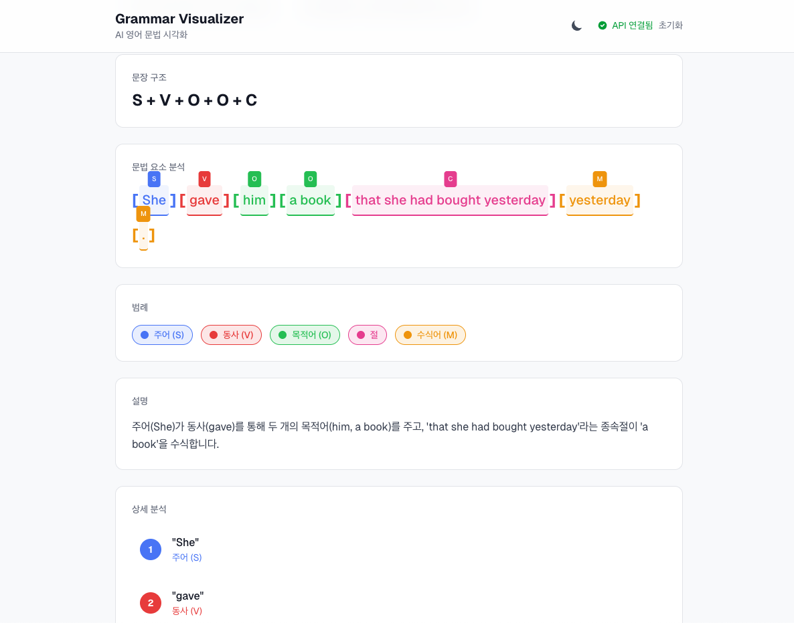

# Grammar Visualizer

영어 문장 구문 분석 시각화 도구 - 복잡한 문법 구조를 직관적으로 표현합니다.




## 주요 기능

- **구문 분석**: AI 기반 영어 문장 문법 구조 분석
- **다층 레벨 시각화**: 괄호, 화살표, 색상 코딩으로 문법 요소 표현
- **실시간 분석**: 문장 입력 시 즉시 구문 분석 결과 표시
- **반응형 레이아웃**: ResizeObserver 기반 동적 좌표 계산

## 기술 스택

| 분류 | 기술 |
|------|------|
| Frontend | Next.js 16, React 19, TypeScript |
| AI | OpenAI GPT API |
| Styling | Tailwind CSS |
| Animation | Framer Motion |

## 시각화 요소

- **괄호 시스템**: 구, 절 단위 그룹핑
- **화살표 연결**: 문법적 관계 표시
- **색상 코딩**: 품사별 색상 구분
- **레벨 표시**: 문법 구조 깊이 시각화

## 시작하기

### 1. 설치

```bash
npm install
```

### 2. 환경 변수 설정

```bash
# .env.local
OPENAI_API_KEY=your-openai-api-key
```

### 3. 실행

```bash
npm run dev
```

http://localhost:3000 에서 확인

## 사용 방법

1. 상단 입력창에 영어 문장 입력
2. "분석" 버튼 클릭
3. 하단에서 구문 분석 시각화 결과 확인

## 프로젝트 구조

```
src/
├── app/
│   ├── api/          # API Routes (OpenAI 연동)
│   └── page.tsx      # 메인 페이지
├── components/       # React 컴포넌트
└── lib/              # 유틸리티 함수
```

## 라이선스

MIT License
